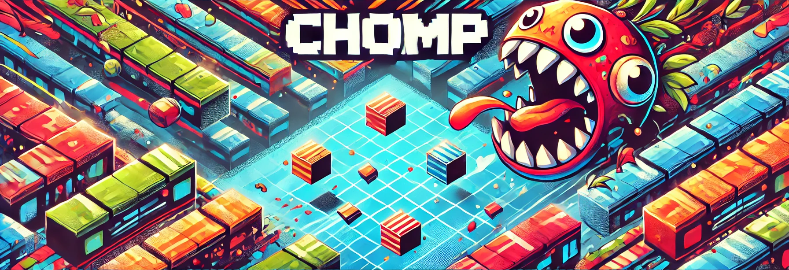
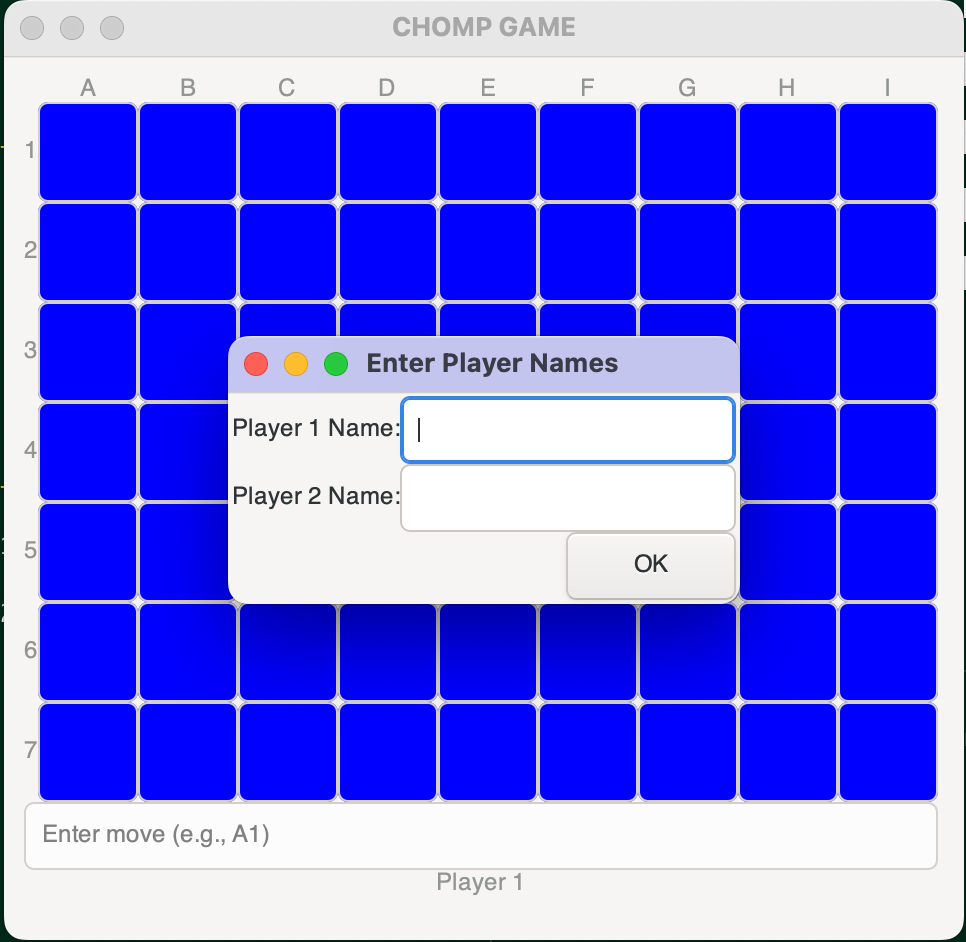
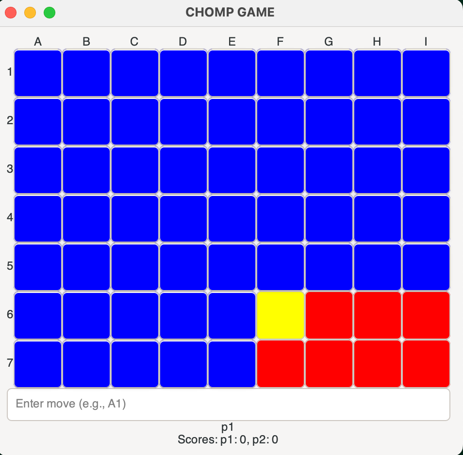
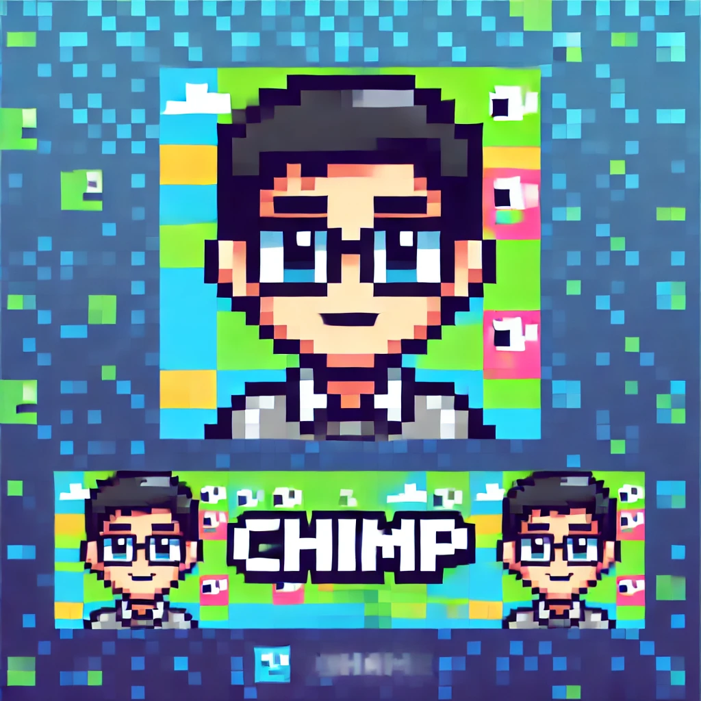
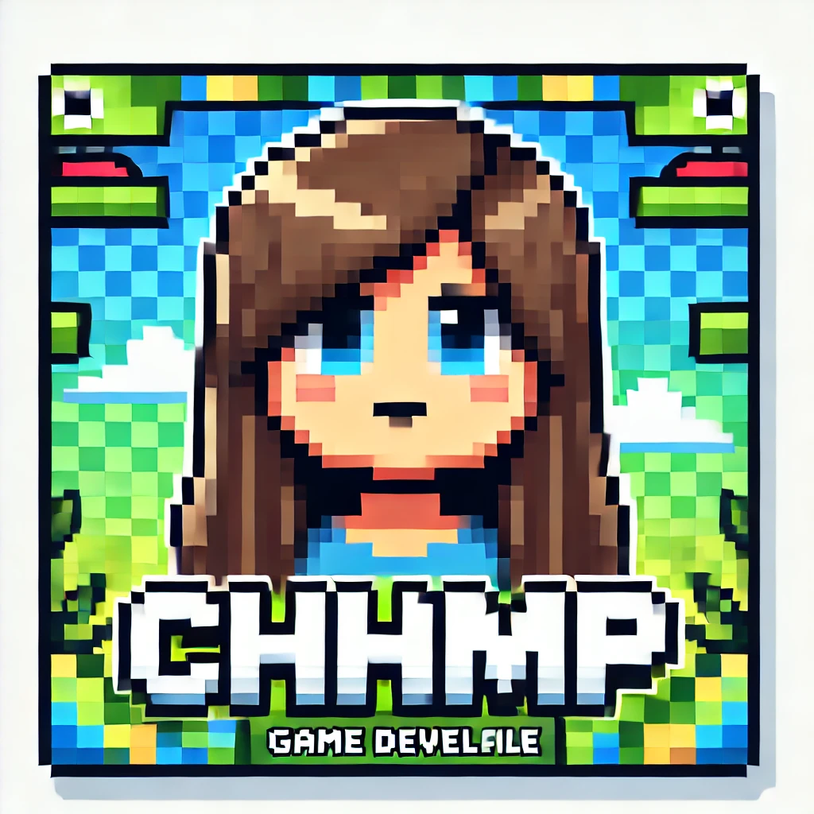
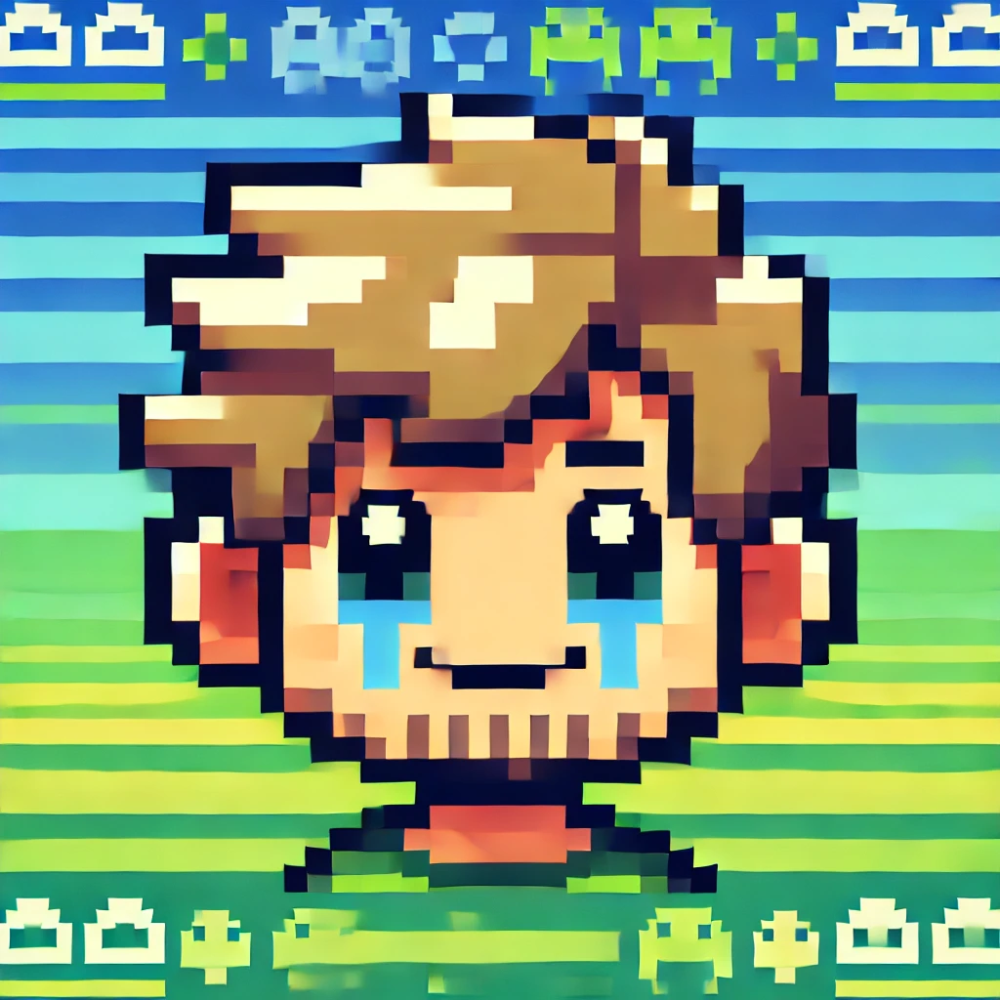
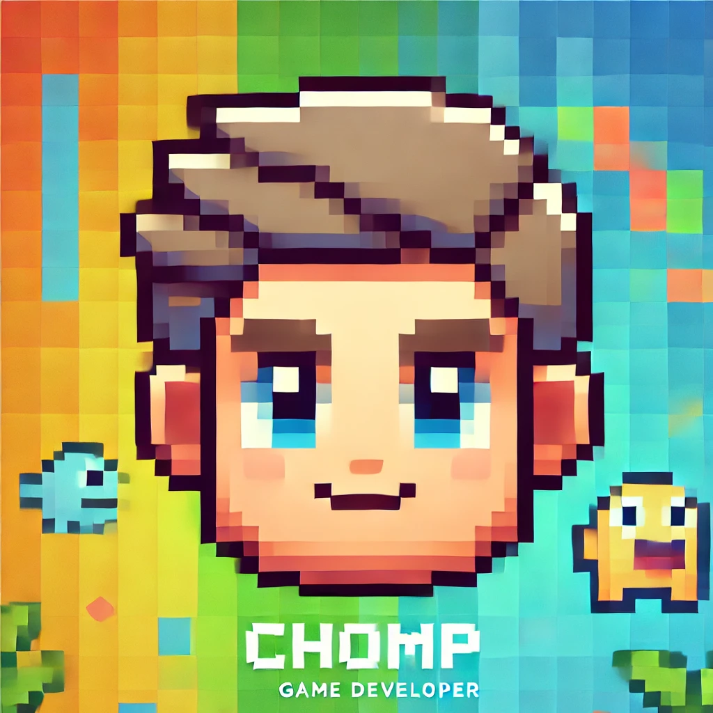
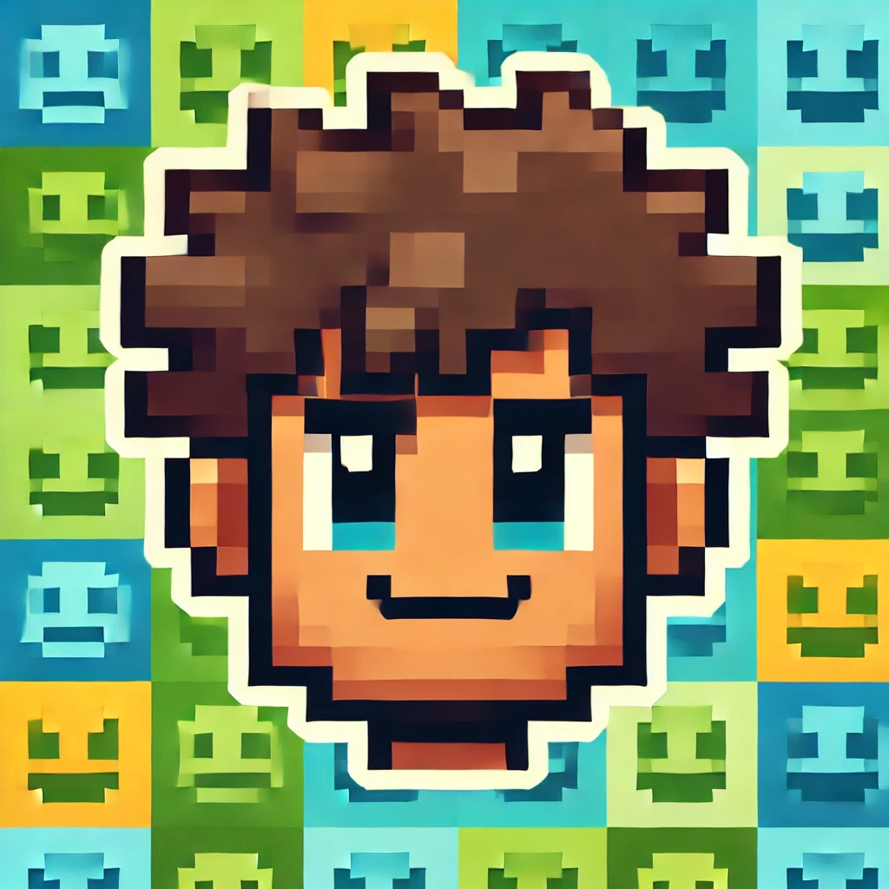
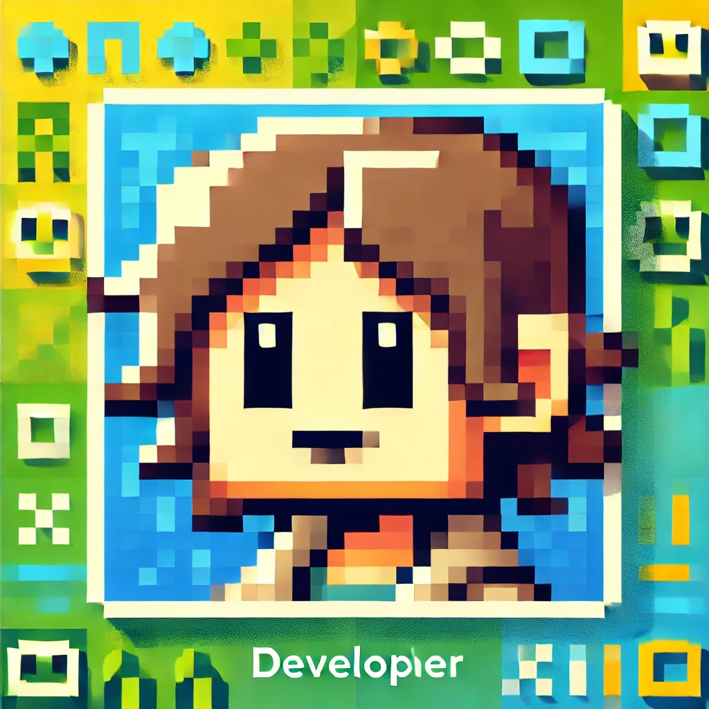
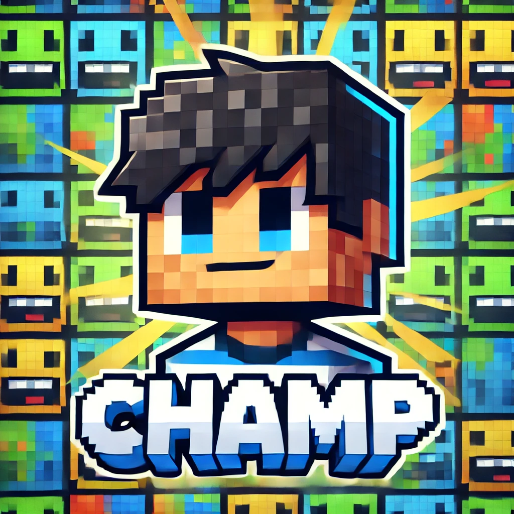

# 🎮 Immersion Project "PISCINE" 

**IR 1 - BUT RT 3**


<p align="center">
  
</p>

## 📖 Table of Contents

- [🎮 Immersion Project "PISCINE"]
  - [📖 Table of Contents]
  - [🕹️ The Game]
  - [📋 Specifications]
  - [📦 Installation]
  - [🛠️ Compilation]
  - [📦 Documentation]
  - [🚀 Run]
    - [🏠 Run Locally]
    - [🌐 Run with Network]
      - [📥 Client]
      - [🗄️ Server]
  - [👥 Authors]


## 🕹️ The Game 

**Square Game (Chomp Game)**

- 🟦 **Rectangular board of dimensions 7x9**
- 🤝 **Two opposing players**
- 🔄 **Turn-based gameplay**
  - On their turn, a player chooses a square on the board:
    - 🧱 The chosen square is destroyed,
    - 💥 All squares below and to the right of the chosen square are also destroyed.
  - 🔢 A player can destroy a maximum of **5 squares per turn**.
- 🎯 **Goal**: The player who destroys the **last square loses**.

<p align="center">
  
  
</p>

## 📋 Specifications 

- 💻 Developed in **C language** (compilable with gcc)
- 🖥️ Executable on **Linux** or **MacOS** machines
- 🛠️ Option to install a **virtual machine** if needed
- ⚙️ Code runs on a **standard architecture** (e.g., 8 cores, 2.5GHz, 16GB RAM)

## 📦 Installation 

To install the game, use the **** script.

```bash
./install.sh
```

The script will install all necessary dependencies.

## 🛠️ Compilation

To compile the game, use the **** script.

```bash
./compile.sh
```

This will compile the game and create the executable file named **game**.
It will also make the documentation available in the **docs** folder.

## 📦 Documentation 

- The documentation is generated using **Doxygen** with `make docs`, it is already done in the **compile.sh** script.

- To access the documentation, open the **docs** folder and open the **index.html** file in your browser.
  You can also use the **Five server** extension in your IDE or nginx/apache. 
```bash
cd project/docs/html
open index.html
```

## 🚀 Run 

You have multiple options when it comes to running the game:

### 🏠 Run Locally 

- To run the game locally, use the **`-l`** argument.
- Additional options:
  - 🖥️  **CLI Mode**: Add the **`-t`** argument.
  - 🤖 **AI Mode**: Add the **`-ia`** argument.
  - 🖥️ 🤖 **CLI + AI Mode**: Add both **`-t`** and **`-ia`** arguments.

```bash
# Run locally
./game -l

# Run locally with GUI
./game -l -g

# Run locally with AI in terminal mode
./game -l -t -ia

# Run locally with GUI and AI
./game -l -ia
```

### 🌐 Run with Network 

#### 📥 Client 

- To run the client, use the **`-c`** argument along with the server's IP address and port.
- Additional options:
  - 🖥️  **CLI Mode**: Add the **`-t`** argument.
  - 🤖 **AI Mode**: Add the **`-ia`** argument.
  - 🖥️ 🤖 **CLI + AI Mode**: Add both **`-t`** and **`-ia`** arguments.

```bash
# Run client in the terminal
./game -c <server_ip>:<port> -t

# Run client with GUI
./game -c <server_ip>:<port> 

# Run client with AI in the terminal
./game -c <server_ip>:<port> -t -ia

# Run client with GUI and AI
./game -c <server_ip>:<port> -ia
```

#### 🗄️ Server 

- To run the server, use the **`-s`** argument with the desired port.
  - *Uses the IP address of the host machine.*
- Additional options:
  - 🖥️  **CLI Mode**: Add the **`-t`** argument.
  - 🤖 **AI Mode**: Add the **`-ia`** argument.
  - 🖥️ 🤖 **CLI + AI Mode**: Add both **`-t`** and **`-ia`** arguments.

```bash
# Run server in the terminal
./game -s <port> -t

# Run server with GUI
./game -s <port> 

# Run server with AI in the terminal
./game -s <port> -ia -t

# Run server with GUI and AI
./game -s <port> -ia
```

> **Note:** Combine multiple arguments to tailor your game experience.

## 👥 Authors 
This project is created and maintained by:

<table>
  <tr>
    <td><a href="mailto:samuel.rolli@uha.fr"></a></td>
    <td><a href="mailto:elise.beauvy@uha.fr"></a></td>
    <td><a href="mailto:martin.baratte@uha.fr"></a></td>
    <td><a href="mailto:basile.le-thiec@uha.fr"></a></td>
    <td><a href="mailto:louay.ben-ltoufa@uha.fr"></a></td>
    <td><a href="mailto:sakithyan.ragavan@uha.fr"></a></td>
    <td><a href="mailto:mehmet.bozkurt@uha.fr"></a></td>
  </tr>
  <tr>
    <td><a href="mailto:samuel.rolli@uha.fr">Samuel ROLLI</a></td>
    <td><a href="mailto:elise.beauvy@uha.fr">Elise BEAUVY</a></td>
    <td><a href="mailto:martin.baratte@uha.fr">Martin BARATTE</a></td>
    <td><a href="mailto:basile.le-thiec@uha.fr">Basile LE THIEC</a></td>
    <td><a href="mailto:louay.ben-ltoufa@uha.fr">Louay BEN LTOUFA</a></td>
    <td><a href="mailto:sakithyan.ragavan@uha.fr">Sakithyan RAGAVAN</a></td>
    <td><a href="mailto:mehmet.bozkurt@uha.fr">Mehmet BOZKURT</a></td>
  </tr>
</table>

Feel free to reach out to any of us for questions!
